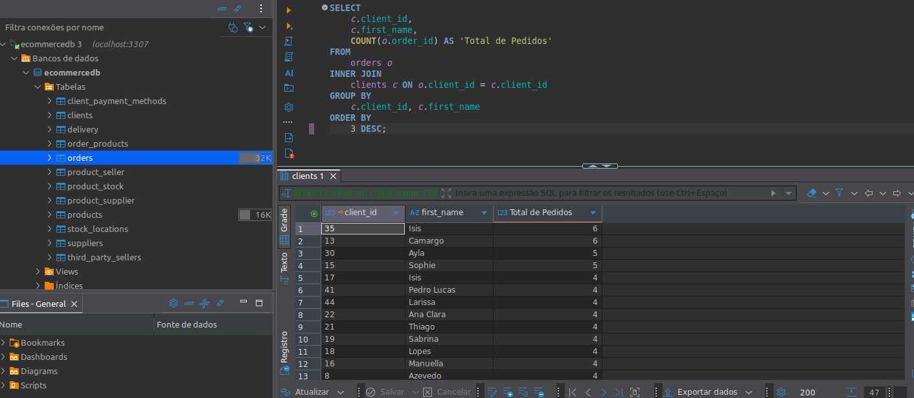
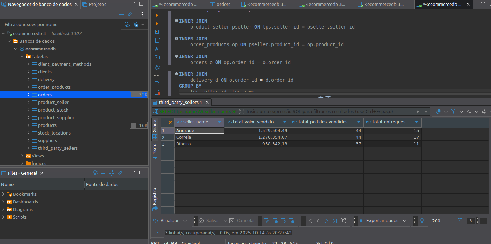
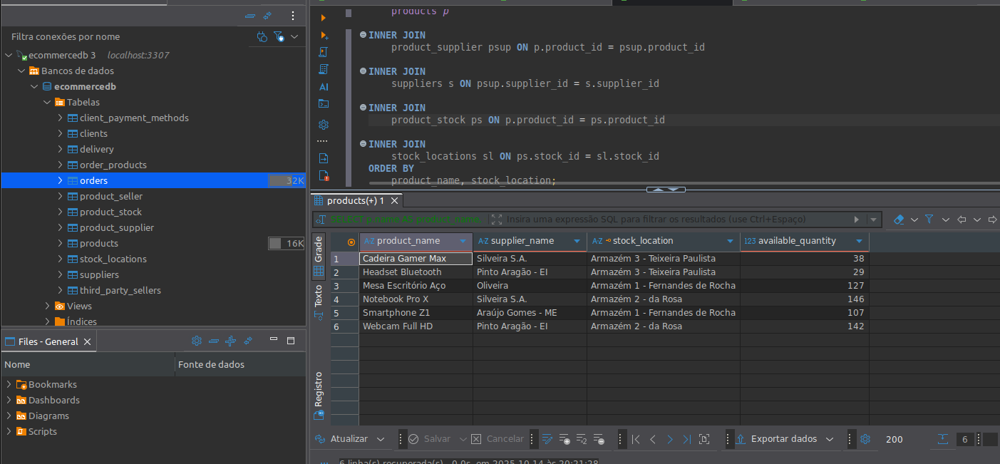
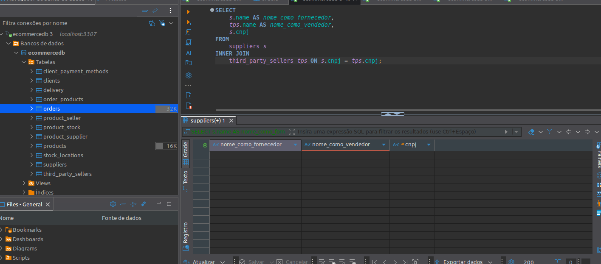

# Projeto de Modelagem de E-commerce (MySQL + Docker)

## Objetivo Principal do Projeto

Este projeto consiste na modelagem e implementação de um banco de dados relacional (MySQL) para um sistema de e-commerce. O objetivo é gerenciar o fluxo completo de vendas, desde o cadastro de clientes (Pessoa Física e Jurídica), controle detalhado de pedidos, gestão de estoque, até o rastreamento logístico de entregas.

A modelagem é projetada para garantir a integridade e a rastreabilidade dos dados, suportando consultas complexas que simulam análises de negócio reais.

## Tecnologias Utilizadas

* **SGBD:** MySQL 8.0 (Executado via Docker)
* **Orquestração:** Docker Compose (Para configuração de ambiente, persistência de dados e mapeamento de portas)
* **Geração de Dados:** Python 3 + Bibliotecas `Faker` e `mysql-connector-python` (Para inserção de uma massa de dados robusta: **50 Clientes e 130 Pedidos**).

## Como Executar o Projeto Localmente

### 1. Pré-requisitos

Certifique-se de que você tem instalado:

* Docker e Docker Compose
* Python 3 (Recomendado 3.8+)
* Cliente SQL (DBeaver, MySQL Workbench, etc.)

### 2. Configuração do Ambiente Python

Instale as bibliotecas necessárias para a geração de dados:

```bash
pip install mysql-connector-python faker
```

### 4. Alimentação do Banco de Dados em Massa

Execute o script Python para limpar as tabelas e inserir os dados de exemplo (50 Clientes, 130 Pedidos, etc.) no banco de dados ativo. Este item foi construído com apoio do

```bash
# Execute o script Python na pasta raiz do projeto:
python data_generator.py
```

Aguarde a mensagem de "GERAÇÃO DE DADOS CONCLUÍDA".

### 5. Dados de Conexão

Use o seu cliente SQL (DBeaver/Workbench) com as seguintes credenciais para acessar o esquema `ecommercedb`:

| Campo              | Valor           |
| :----------------- | :-------------- |
| **Host**     | `localhost`   |
| **Porta**    | `3307`        |
| **Database** | `ecommercedb` |
| **Usuário** | `root`        |
| **Senha**    | `admin123`    |

## Provas de Funcionalidade (Queries de Negócio)

O arquivo **`init/03_queries.sql`** contém consultas que demonstram a capacidade de resposta do modelo.

### 1. Clientes por Pedido (Agregação e Relacionamento 1:N)

**Objetivo:** Contar quantos pedidos cada cliente (PF ou PJ) fez, listando o nome e o total.

#### Resultado (Print da Query 1):



---

### 2. Desempenho do Marketplace (Agregação e Múltiplos JOINs)

**Objetivo:** Analisar o valor total vendido e a eficiência logística (entregas) por Vendedor Terceiro.

#### Resultado (Print da Query 2):



---

### 3. Relação Fornecedor/Estoque (Logística e Mapeamento de 4 Tabelas)

**Objetivo:** Ligar a cadeia de suprimentos (fornecedor) à disponibilidade do produto no estoque por localização e quantidade.

#### Resultado (Print da Query 3):



---

### 4. Vendedor vs. Fornecedor (Integridade de Dados)

**Objetivo:** Verificar se alguma entidade atua simultaneamente como fornecedor e vendedor externo (CNPJ em comum).

#### Resultado (Print da Query 4):


